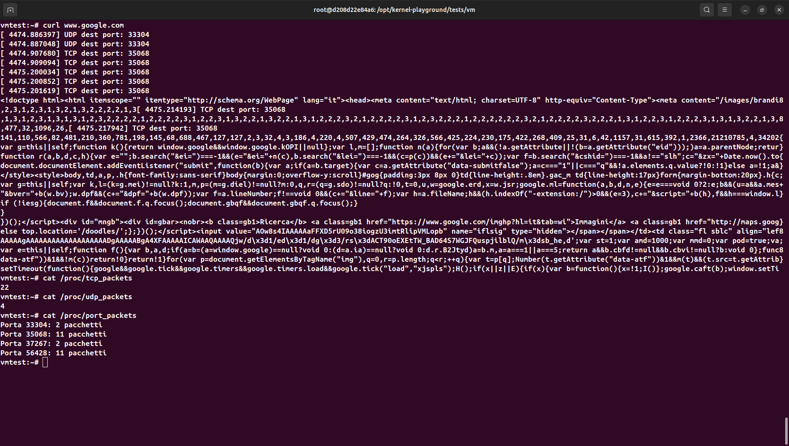

# Custom Kernel Module for Packets Counting

This project demonstrates how to create a custom Linux kernel module designed to count TCP and UDP packets, and send a warning every 100 received TCP or UDP. Last thing, we have to have a file containing the counters for each used port. 

## Installation Instructions

The directory contains a `Makefile` with predefined targets to manage the build and installation process:

### Targets

- **build**: Compile the kernel module. This will generate a `.ko` file that can be loaded into the kernel.
  
- **install**: Copy the compiled `.ko` module into the shared folder accessible within your VM. This shared folder is linked via a symbolic link named `shared` in the current directory, allowing easy access from the Guest OS running in the VM.
  
- **clean**: Remove all build artifacts, including the `.ko` file, to clean up the directory for a fresh build.

## How to Use

1. **Build the module**

   ```bash
   make build
   ```

2. **Install the module**

   ```bash
   make install
   ```

3. **Clean build artifacts**

   ```bash
   make clean
   ```

Ensure that your environment has the necessary kernel headers and build tools installed to successfully compile the module.

---

*Note:* The actual kernel module source code should be in the `linux` directory, and the `Makefile` is configured to compile it accordingly.


## Mounting Instructions

In the VM

   ```bash
   cd /mnt/shared
   insmod snf_lkm.ko
   ```

Now the module is running.

## Running example

We have to receive a TCP or UDP packet. The best way I found is usign ```curl``` or ```echo "test" > /dev/udp/ip_machine/port_number```. When we use the first, we connect to a webpage and we have a lot of packets exchanged, but no so much control on them. The second send just one packet to our machine on a selected port, and this is perfect in debug. 

To see the results, we use 3 different files:

```cat /proc/tcp_packets  #tcp packets counter``` 

```cat /proc/udp_packets  #udp packets counter```

```cat /proc/port_packets  #port usage counters```

### Results

